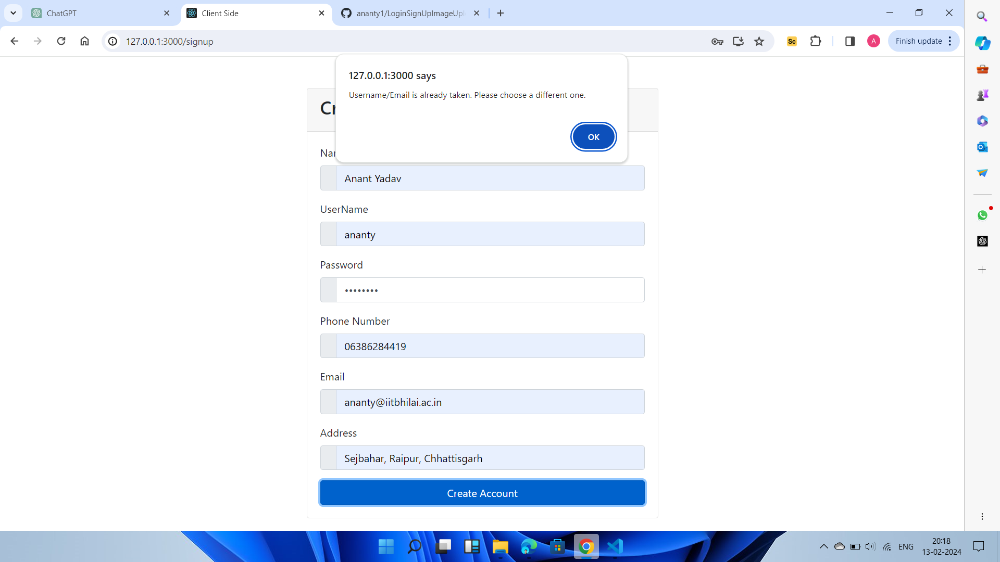
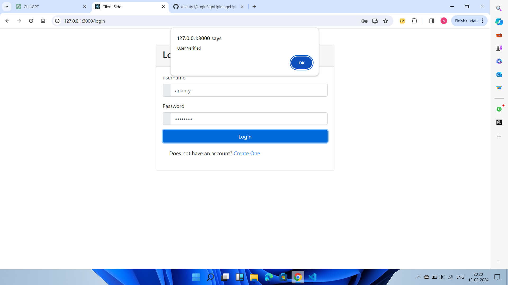

# React Authentication and Image Upload Web App

This is a simple web application built with React where users can sign up, log in, and upload images.

## Features

- User authentication (sign up, log in).
- Image upload functionality.
- Responsive design.

## Technologies Used

- React
- Axios
- React Router
- Node.js (for backend server)
- Express.js (for backend server)
- MySQL (for backend server)
- Other dependencies as required

## Setup Instructions

1. Clone the repository:

    ```bash
    git clone https://github.com/ananty1/LoginSignUpImageUpload.git
    ```

2. Navigate into the project directory:

    ```bash
    cd client
    ```

3. Install dependencies:

    ```bash
    npm install
    ```

4. Start the development server:

    ```bash
    npm start
    ```

5. Access the application in your web browser at [http://localhost:3000](http://localhost:3000).

6. Navigate into the project Backend Directory:

    ```bash
    cd ../backend
    ```

7. Install dependencies:

    ```bash
    npm install
    ```

8. Start the development server:

    ```bash
    npm start
    ```

9. Access the application in your web browser at [http://localhost:5000](http://localhost:5000).

## Usage

1. Sign up for a new account or log in with existing credentials.
2. Navigate to the upload page.
3. Choose a file to upload and click on the upload button.
4. Once the upload is complete, the uploaded image will be displayed on the page.
5. Ensure that the backend is running.

## Sample Images

### SignUpPage


### LoginPage


### UploadImagePage


### UploadedImage Page

